# Project 2: Application Deployment

This project contains a Flask application that integrates with the infrastructure created in Project 1.

## 🏗️ Application Architecture

```mermaid
graph TB
    subgraph "User Access"
        User[👥 Users]
        Browser[🌐 Web Browser]
    end
    
    subgraph "Infrastructure (Project 1)"
        ALB[⚖️ Application Load Balancer<br/>alb-example-123456.ap-south-1.elb.amazonaws.com]
        RDS[(🗄️ PostgreSQL RDS<br/>rds-example.abcdefg.ap-south-1.rds.amazonaws.com)]
        Redis[(🔴 ElastiCache Redis<br/>redis-example.abcdefg.ap-south-1.cache.amazonaws.com)]
        S3[🪣 S3 Bucket<br/>my-app-bucket-12345]
    end
    
    subgraph "Application (Project 2)"
        Container[🐳 Flask Container<br/>Python 3.11]
        App[🐍 Flask Application<br/>Port 5000]
        Env[📄 Environment Variables<br/>RDS_ENDPOINT<br/>REDIS_ENDPOINT<br/>S3_BUCKET]
    end
    
    User --> Browser
    Browser --> ALB
    ALB --> Container
    Container --> App
    Env --> App
    
    App -.-> RDS
    App -.-> Redis
    App -.-> S3
    
    style User fill:#8e44ad
    style ALB fill:#e74c3c
    style Container fill:#3498db
    style App fill:#27ae60
    style RDS fill:#2c3e50
    style Redis fill:#f39c12
    style S3 fill:#16a085
```



## 🔄 CI/CD Pipeline Flow

```mermaid
graph TB
    subgraph "Development"
        Dev[👨‍💻 Developer]
        Code[📝 Code Changes]
        PR[📋 Pull Request]
    end
    
    subgraph "CI Pipeline (Pull Request)"
        CI[🔄 App CI]
        Python[🐍 Setup Python 3.11]
        Install[📦 pip install -r requirements.txt]
        Compile[✅ python -m py_compile]
        Docker[🐳 docker build -t my-app:ci]
    end
    
    subgraph "CD Pipeline (Main Branch)"
        Merge[🔀 Merge to main]
        CD[🚀 App CD]
        TFC[☁️ Fetch TFC Outputs]
        Build[🏗️ docker build -t my-app:latest]
        Deploy[🚀 Deploy Container]
    end
    
    subgraph "Terraform Cloud API"
        API[🔗 TFC API]
        Outputs[📤 Infrastructure Outputs<br/>ALB_DNS<br/>RDS_ENDPOINT<br/>REDIS_ENDPOINT<br/>S3_BUCKET]
    end
    
    subgraph "Runtime Environment"
        Container[🐳 Running Container]
        Flask[🌐 Flask App]
        Display[📺 Display Infrastructure Info]
    end
    
    Dev --> Code
    Code --> PR
    PR --> CI
    CI --> Python
    Python --> Install
    Install --> Compile
    Compile --> Docker
    
    Docker --> Merge
    Merge --> CD
    CD --> TFC
    TFC --> API
    API --> Outputs
    Outputs --> Build
    Build --> Deploy
    Deploy --> Container
    Container --> Flask
    Flask --> Display
    
    style CI fill:#f39c12
    style CD fill:#27ae60
    style TFC fill:#8e44ad
    style Flask fill:#2ecc71
```



## 📱 Application Features

### Flask Application Response
```
Hello from Flask! 🚀
RDS: rds-example.abcdefg.ap-south-1.rds.amazonaws.com
Redis: redis-example.abcdefg.ap-south-1.cache.amazonaws.com
S3: my-app-bucket-12345
```

### Environment Integration

```mermaid
graph LR
    subgraph "Project 1 Outputs"
        O1[alb_dns]
        O2[rds_endpoint]
        O3[redis_endpoint]
        O4[s3_bucket]
    end
    
    subgraph "TFC API Extraction"
        API[🔗 TFC API Call<br/>GET /workspaces/infra-workspace/outputs]
        JSON[📄 JSON Response]
        Parse[⚙️ jq Parse]
    end
    
    subgraph "Environment Variables"
        E1[ALB_DNS]
        E2[RDS_ENDPOINT]
        E3[REDIS_ENDPOINT]
        E4[S3_BUCKET]
    end
    
    subgraph "Flask Application"
        Flask[🐍 os.getenv()]
        Display[📺 Display Values]
    end
    
    O1 --> API
    O2 --> API
    O3 --> API
    O4 --> API
    
    API --> JSON
    JSON --> Parse
    
    Parse --> E1
    Parse --> E2
    Parse --> E3
    Parse --> E4
    
    E1 --> Flask
    E2 --> Flask
    E3 --> Flask
    E4 --> Flask
    
    Flask --> Display
    
    style API fill:#e74c3c
    style Parse fill:#3498db
    style Flask fill:#27ae60
```

## 🐳 Docker Configuration

```dockerfile
FROM python:3.11-slim
WORKDIR /app
COPY requirements.txt .
RUN pip install -r requirements.txt
COPY src/ ./src
WORKDIR /app/src
EXPOSE 5000
CMD ["python", "main.py"]
```

## 🛠️ Usage

### Local Development
```bash
# Build and run locally
cd app-project/app-code
docker build -t my-app:local .
docker run -p 5000:5000 \
  -e RDS_ENDPOINT="rds-example.abcdefg.ap-south-1.rds.amazonaws.com" \
  -e REDIS_ENDPOINT="redis-example.abcdefg.ap-south-1.cache.amazonaws.com" \
  -e S3_BUCKET="my-app-bucket-12345" \
  my-app:local

# Access application
curl http://localhost:5000
```

### Production Deployment
```bash
# Ensure Project 1 is deployed first
# Push code to trigger CI/CD
git checkout -b feature/app-update
git add .
git commit -m "Update Flask application"
git push origin feature/app-update

# Create PR → CI runs (build, test)
# Merge to main → CD runs (fetch outputs, deploy)
```

## 🔗 TFC API Integration

The CD workflow automatically fetches infrastructure outputs:

```bash
# Get TFC outputs via API
curl \
  --header "Authorization: Bearer $TFC_TOKEN" \
  https://app.terraform.io/api/v2/workspaces/infra-workspace/outputs \
  > infra_outputs.json

# Extract values using jq
export ALB_DNS=$(jq -r '.data[] | select(.name=="alb_dns") | .value' infra_outputs.json)
export RDS_ENDPOINT=$(jq -r '.data[] | select(.name=="rds_endpoint") | .value' infra_outputs.json)
export REDIS_ENDPOINT=$(jq -r '.data[] | select(.name=="redis_endpoint") | .value' infra_outputs.json)
export S3_BUCKET=$(jq -r '.data[] | select(.name=="s3_bucket") | .value' infra_outputs.json)
```

## 📋 Required Secrets

Configure these secrets in GitHub Actions:

| Secret | Description | Example |
|--------|-------------|---------|
| `TFC_TOKEN` | Terraform Cloud API token | `ATxxxxxxxxxxxxx` |

## 📁 File Structure

```
app-project/
├── app-code/
│   ├── src/main.py            # Flask application
│   ├── requirements.txt       # Python dependencies (Flask 3.0.0)
│   └── Dockerfile            # Container definition
├── config/app_config.yaml    # Application configuration
└── .github/workflows/
    ├── ci-app.yml            # Build and test on PR
    └── cd-app.yml            # Deploy on main branch
```

## 🎯 Integration Flow

1. **Project 1** deploys infrastructure → stores outputs in TFC
2. **Project 2** fetches TFC outputs → injects as environment variables
3. **Flask app** displays infrastructure endpoints → proves integration
4. **Users** access via ALB DNS → see live infrastructure details

This demonstrates complete Infrastructure as Code + Application deployment integration! 🚀