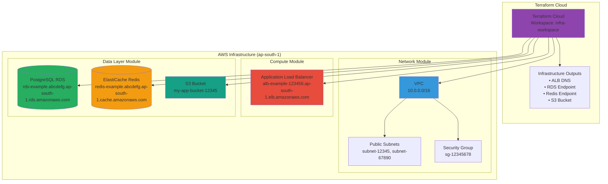
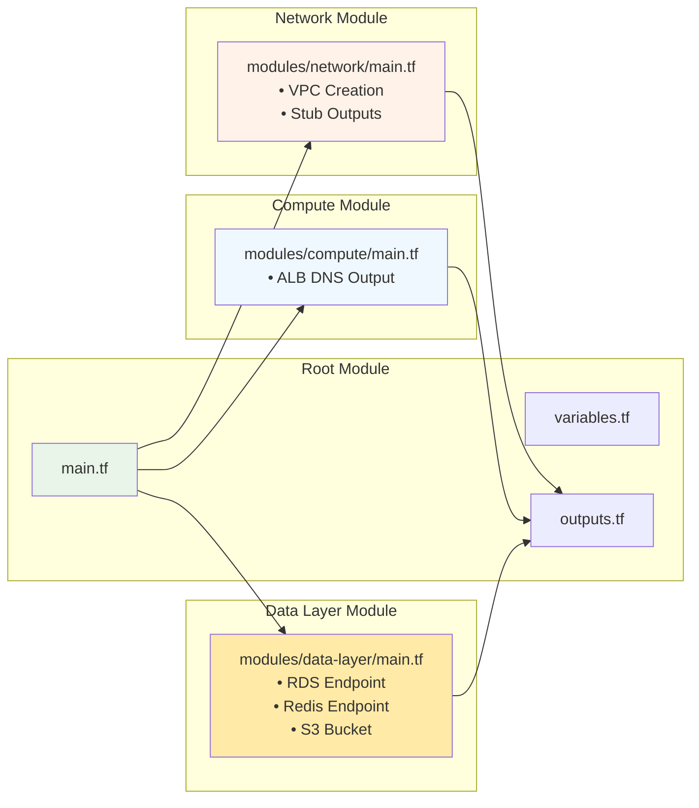
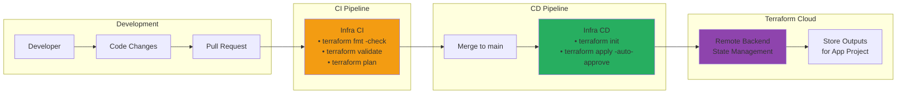

# Project 1: Infrastructure (Terraform)

This project creates the AWS infrastructure using Terraform with a modular approach.

## 🏗️ Architecture Overview



## 📦 Module Structure



## 🚀 CI/CD Pipeline



## 📋 Resources Created

| Module | Resource Type | Output | Description |
|--------|---------------|--------|-------------|
| **Network** | VPC | vpc_id | Virtual Private Cloud |
| | Subnets | public_subnets | Public subnet IDs (stubbed) |
| | Security Group | alb_sg | ALB security group (stubbed) |
| **Compute** | ALB | alb_dns | Application Load Balancer DNS |
| **Data Layer** | RDS | rds_endpoint | PostgreSQL database endpoint |
| | Redis | redis_endpoint | ElastiCache Redis endpoint |
| | S3 | s3_bucket | S3 bucket name |

## 🛠️ Usage

### Prerequisites
- Terraform Cloud account
- AWS credentials configured in TFC
- GitHub repository with Actions enabled

### Setup Steps

1. **Configure Terraform Cloud Backend**
   ```hcl
   # Update organization and workspace in main.tf
   terraform {
     backend "remote" {
       organization = "your-tfc-org"
       workspaces {
         name = "infra-workspace"
       }
     }
   }
   ```

2. **Set Variables in TFC**
   - `aws_region` = "ap-south-1"
   - `vpc_cidr` = "10.0.0.0/16"
   - `db_username` = "admin"
   - `db_password` = "your-secure-password" (sensitive)

3. **Deploy Infrastructure**
   ```bash
   # Create PR → CI runs (format, validate, plan)
   git checkout -b feature/infrastructure
   git add .
   git commit -m "Add infrastructure code"
   git push origin feature/infrastructure
   
   # Merge to main → CD runs (apply)
   ```

### Infrastructure Outputs

After deployment, these outputs are available in TFC:

```bash
alb_dns = "alb-example-123456.ap-south-1.elb.amazonaws.com"
rds_endpoint = "rds-example.abcdefg.ap-south-1.rds.amazonaws.com"
redis_endpoint = "redis-example.abcdefg.ap-south-1.cache.amazonaws.com"
s3_bucket = "my-app-bucket-12345"
```

## 🔗 Integration with Project 2

The application project (Project 2) automatically fetches these outputs via Terraform Cloud API during deployment:

```bash
# App CD workflow fetches outputs
curl --header "Authorization: Bearer $TFC_TOKEN" \
     https://app.terraform.io/api/v2/workspaces/infra-workspace/outputs
```

## 📁 File Structure

```
infra-project/
├── terraform/
│   ├── main.tf                    # Root module with provider config
│   ├── variables.tf               # Input variables
│   ├── outputs.tf                 # Infrastructure outputs
│   ├── userdata.sh               # EC2 bootstrap script
│   └── modules/
│       ├── network/main.tf        # VPC and networking (stub)
│       ├── compute/main.tf        # ALB configuration (stub)
│       └── data-layer/main.tf     # RDS, Redis, S3 (stub)
└── .github/workflows/
    ├── ci-infra.yml              # Pull request validation
    └── cd-infra.yml              # Main branch deployment
```

This infrastructure provides the foundation for the Flask application in Project 2! 🚀